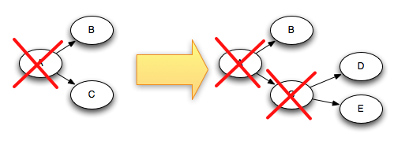

Storm提供了几种不同级别的保证消息处理，包括尽最大努力，至少一次，和通过[Trident](Trident-tutorial.md)完成一次。
此页面描述了Storm如何保证至少一次处理。

### 消息“完全处理”是什么意思？

来自“spout”的元组可以触发基于它的数千个元组。例如，考虑流式字数统计拓扑：

```java
TopologyBuilder builder = new TopologyBuilder();
builder.setSpout("sentences", new KestrelSpout("kestrel.backtype.com",
                                               22133,
                                               "sentence_queue",
                                               new StringScheme()));
builder.setBolt("split", new SplitSentence(), 10)
        .shuffleGrouping("sentences");
builder.setBolt("count", new WordCount(), 20)
        .fieldsGrouping("split", new Fields("word"));
```

这种拓扑结构从Kestrel队列中读出句子，将句子分成其组成单词，然后为每个单词发出之前看过该单词的次数。从spout中释放的元组会触发基于它创建的许多元组：句子中每个单词的元组和每个单词更新计数的元组。消息树看起来像这样：


当元组树已经用完并且树中的每条消息都已处理完毕时，Storm会认为元组是从spout“完全处理”中发出的。如果在指定的超时内无法完全处理其消息树，则认为该元组失败。可以使用[Config.TOPOLOGY_MESSAGE_TIMEOUT_SECS](javadocs/org/apache/storm/Config.md#TOPOLOGY_MESSAGE_TIMEOUT_SECS)配置在特定于拓扑的基础上配置此超时，默认为30秒。

### 如果消息已完全处理或无法完全处理，会发生什么？

要理解这个问题，让我们来看一下来自“spout”的元组的生命周期。作为参考，这里是`spouts`实现的接口(有关更多信息，请参阅[Javadoc](javadocs/org/apache/storm/spout/ISpout.md)):

```java
public interface ISpout extends Serializable {
    void open(Map conf, TopologyContext context, SpoutOutputCollector collector);
    void close();
    void nextTuple();
    void ack(Object msgId);
    void fail(Object msgId);
}
```

首先，Storm通过调用`Spout`上的`nextTuple`方法从`Spout`请求一个元组。 `Spout`使用`open`方法中提供的`SpoutOutputCollector`来向其输出流之一发出元组。当发出一个元组时，`Spout`提供了一个“消息id”，用于稍后识别元组。例如，`KestrelSpout`从kestrel队列中读取一条消息，并将“消息id”作为消息的Kestrel提供的id发出。向`SpoutOutputCollector`发送消息如下所示：

```java
_collector.emit(new Values("field1", "field2", 3) , msgId);
```

接下来，元组被发送到消费'bolt'，Storm负责跟踪创建的消息树。如果Storm检测到元组已完全处理，Storm将在原始的“Spout”任务上调用`ack`方法，并使用“Spout”提供给Storm的消息ID。同样，如果元组超时Storm将在`Spout`上调用`fail`方法。请注意，元组将被创建它的完全相同的“Spout”任务确认或失败。因此，如果一个`Spout`在整个集群中执行尽可能多的任务，那么一个元组将不会被创建它的任务(不同的任务)确认或失败。

让我们再次使用`KestrelSpout`来看看`Spout`需要做什么来保证消息处理。当`KestrelSpout`从Kestrel队列中取消一条消息时，它会“打开”该消息。这意味着消息实际上并未从队列中取出，而是处于“挂起”状态，等待确认消息已完成。处于挂起状态时，将不会向队列的其他使用者发送消息。此外，如果客户端断开该客户端的所有挂起消息，则将其重新放回队列。当打开消息时，Kestrel会为客户端提供消息的数据以及消息的唯一ID。当将元组发送到`SpoutOutputCollector`时，`KestrelSpout`使用该确切的id作为元组的“消息id”。稍后，当`KestrelSpout`上调用`ack`或`fail`时，`KestrelSpout`会向Kestrel发送一条ack或fail消息，消息ID将消息从队列中取出或重新打开。

### 什么是Storm的可靠性API？

作为用户，您必须做两件事才能从Storm的可靠性功能中受益。 首先，只要在元组树中创建新链接，就需要告诉Storm。 其次，当你完成处理单个元组时，你需要告诉Storm。 通过执行这两项操作，Storm可以检测元组树何时完全处理，并且可以适当地使spout元组确认或失败。 Storm的API提供了完成这两项任务的简洁方法。

在元组树中指定链接称为 _anchoring_ 。锚定是在您发出新元组的同时完成的。 我们以下面的bolt为例。 此bolt将包含句子的元组拆分为每个单词的元组：

```java
public class SplitSentence extends BaseRichBolt {
        OutputCollector _collector;

        public void prepare(Map conf, TopologyContext context, OutputCollector collector) {
            _collector = collector;
        }

        public void execute(Tuple tuple) {
            String sentence = tuple.getString(0);
            for(String word: sentence.split(" ")) {
                _collector.emit(tuple, new Values(word));
            }
            _collector.ack(tuple);
        }

        public void declareOutputFields(OutputFieldsDeclarer declarer) {
            declarer.declare(new Fields("word"));
        }        
    }
```

通过将输入元组指定为`emit`的第一个参数，每个单词元组都是 _anchored_ 。由于单词元组被锚定，如果单词元组未能在下游处理，则稍后将重放树根处的spout元组。相比之下，让我们看一下如果像这样发出单词元组会发生什么：

```java
_collector.emit(new Values(word));
```

以这种方式发出单词元组会导致它被 _unanchored_ 。如果在下游处理元组失败，则不会重放根元组。根据拓扑中所需的容错保证，有时发出未锚定的元组是合适的。

输出元组可以锚定到多个输入元组。这在进行流连接或聚合时很有用。无法处理的多锚元组将导致从spouts重放多个元组。通过指定元组列表而不仅仅是单个元组来完成多锚定。例如：

```java
List<Tuple> anchors = new ArrayList<Tuple>();
anchors.add(tuple1);
anchors.add(tuple2);
_collector.emit(anchors, new Values(1, 2, 3));
```

多锚定将输出元组添加到多个元组树中。请注意，多锚定也可以打破树结构并创建元组DAG，如下所示：


Storm的实现适用于DAG和树(预发布它只适用于树,名称"tuple tree" stuck).

锚定是指定元组树的方式 -  Storm的可靠性API的下一个和最后一个部分是指定何时完成处理元组树中的单个元组。这是通过在`OutputCollector`上使用`ack`和`fail`方法完成的。如果回顾一下`SplitSentence`示例，您可以看到在发出所有单词元组之后输入元组被确认。

您可以使用`OutputCollector`上的`fail`方法立即使元组树根处的spout元组失败。例如，您的应用程序可能会选择从数据库客户端捕获异常并显式地使输入元组失败。通过明确地使元组失败，可以比等待元组超时更快地重放spout元组。

您处理的每个元组都必须被确认或失败。 Storm使用内存来跟踪每个元组，因此如果你不对每个元组进行ack/fail，那么任务最终会耗尽内存。

许多bolt遵循读取输入元组的共同模式，基于它发出元组，然后在“execute”方法结束时执行元组。这些bolt属于过滤器和简单功能的范畴。 Storm有一个名为`BasicBolt`的接口，它为你封装了这个模式。 `SplitSentence`示例可以写成`BasicBolt`，如下所示：

```java
public class SplitSentence extends BaseBasicBolt {
        public void execute(Tuple tuple, BasicOutputCollector collector) {
            String sentence = tuple.getString(0);
            for(String word: sentence.split(" ")) {
                collector.emit(new Values(word));
            }
        }

        public void declareOutputFields(OutputFieldsDeclarer declarer) {
            declarer.declare(new Fields("word"));
        }        
    }
```

此实现比之前的实现更简单，并且在语义上是相同的。发送到`BasicOutputCollector`的元组会自动锚定到输入元组，并在execute方法完成时自动为确认输入元组。

相反，执行聚合或连接的螺栓可能会延迟对元组进行确认，直到它根据一堆元组计算结果为止。聚合和连接通常也会多次锚定它们的输出元组。这些东西不属于`IBasicBolt`的简单模式。

### 如果可以重放元组，我该如何让我的应用程序正常工作？

与软件设计一样，答案是“它取决于”。如果你真的想要一次语义使用 [Trident](Trident-tutorial.md) API。在某些情况下，与大量分析一样，丢弃数据是正常的，因此通过将acker bolts的数量设置为0[Config.TOPOLOGY_ACKERS](javadocs/org/apache/storm/Config.md#TOPOLOGY_ACKERS)来禁用容错。但在某些情况下，您希望确保所有内容都至少处理过一次，并且没有任何内容被删除。如果所有操作都是幂等的，或者重复删除可能会发生，则此功能尤其有用。

### Storm如何以有效的方式实现可靠性？

Storm拓扑具有一组特殊的“acker”任务，用于跟踪每个spout元组的元组DAG。当acker看到DAG完成时，它会向spout任务发送一条消息，该消息创建了spout元组来确认消息。您可以使用[Config.TOPOLOGY_ACKERS](javadocs/org/apache/storm/Config.md#TOPOLOGY_ACKERS)在拓扑配置中设置拓扑的acker任务数。Storm将TOPOLOGY_ACKERS默认为每个工作一个任务。

了解Storm可靠性实现的最佳方法是查看元组和元组DAG的生命周期。当在拓扑中创建元组时，无论是在spout还是bolt中，都会给它一个随机的64位id。 ackers使用这些id来跟踪每个spout元组的元组DAG。

每个元组都知道它们在元组树中存在的所有spout元组的ID。当你在一个螺栓中发出一个新的元组时，来自元组的锚点的spout元组id被复制到新的元组中。当一个元组被确认时，它会向相应的acker任务发送一条消息，其中包含有关元组树如何变化的信息。特别是它告诉acker“我现在已经在树中完成了这个spout元组，这里是树中新的元组，它们固定在我身上”。

例如，如果元组“D”和“E”是基于元组“C”创建的，这里是当“C”被确认时元组树如何变化：



由于在添加“D”和“E”的同时从树中移除“C”，因此树永远不会过早地完成。

还有一些关于Storm跟踪元组树的细节。如前所述，您可以在拓扑中拥有任意数量的acker任务。这导致了以下问题：它如何知道哪个acker任务发送了该信息？

Storm使用散列求余运算将spout元组id映射到acker任务。由于每个元组都带有它们存在的所有树的spout元组ID，因此它们知道要与之通信的acker任务。

Storm的另一个细节是acker任务如何跟踪哪些spout任务负责他们正在跟踪的每个spout元组。当spout任务发出新元组时，它只是向适当的acker发送一条消息，告诉它其任务id负责该spout元组。然后当acker看到树已经完成时，它知道发送完成消息的任务id。

Acker任务不会显式跟踪元组树。对于具有数万个节点（或更多）的大型元组树，跟踪所有元组树可能会压垮ackers使用的内存。相反，ackers采用不同的策略，每个spout元组只需要固定数量的空间（大约20个字节）。这种跟踪算法是Storm工作的关键，也是其重大突破之一。

acker任务存储从spout元组id到一对值的映射。第一个值是创建spout元组的任务ID，稍后用于发送完成消息。第二个值是64位数字，称为“ack val”。ack val表示整个元组树的状态，无论多大或多小。它只是已在树中创建和/或确认的所有元组ID做异或。

当acker任务看到“ack val”变为0时，它就知道元组树已经完成。由于元组id是随机的64位数，因此“ack val”意外变为0的可能性非常小。如果你以每秒10K acks的速度进行数学运算，则需要花费50,000，000年才会出现错误。即使这样，如果拓扑中的元组发生故障，它也只会导致数据丢失。

既然您已经了解了可靠性算法，那么让我们回顾一下所有的失败案例，看看Storm在每种情况下如何避免数据丢失：

- **因为任务死掉一个元组没有被确认**: 在这种情况下，失败元组的树根处的spout元组id会超时并被重放。
- **Acker任务死掉**: 在这种情况下，acker跟踪的所有spout元组都会超时并重放
- **Spout任务死掉**: 在这种情况下，spout与之对话的来源负责重放消息。例如，当客户端断开连接时，像Kestrel和RabbitMQ这样的队列会将所有挂起的消息放回队列中。

如您所见，Storm的可靠性机制是完全分布式，可伸缩的和容错的。

### 调整可靠性

Acker任务是轻量级的，因此在拓扑中不需要很多任务。您可以通过Storm UI（组件ID“__acker”）跟踪它们的性能。如果吞吐量看起来不正确，则需要添加更多的acker任务。

如果可靠性对您不重要 - 也就是说，您不关心在失败情况下丢失元组 - 那么您可以通过不跟踪元组树的spout元组来提高性能。不跟踪元组树将传输的消息数减半，因为通常在元组树中的每个元组都有一条确认消息。此外，它需要在每个下游元组中保留更少的ID，从而减少带宽使用。

有三种方法可以消除可靠性。第一种方法是将Config.TOPOLOGY_ACKERS设置为0。在这种情况下，Storm会在spout发出元组后立即调用spout上的`ack`方法。将不会跟踪元组树。

第二种方法是逐个消息地删除可靠性。您可以通过省略`SpoutOutputCollector.emit`方法中的消息ID来关闭单个spout元组的跟踪。

最后，如果您不关心拓扑中下游的元组的特定子集是否无法处理，则可以将它们作为未锚定的元组发出。因为它们没有锚定到任何spout元组，所以如果它们没有被确认，它们将不会导致任何spout元组失败。
