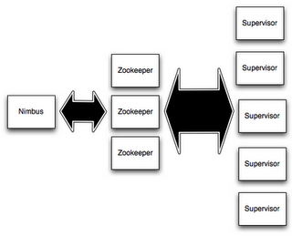

在本教程中，您将学习如何创建Storm拓扑并将其部署到Storm集群。 Java将是使用的主要语言，但是一些示例将使用Python来说明Storm的多语言功能。

## Preliminaries

本教程使用 [storm-starter]({{page.git-blob-base}}/examples/storm-starter) 项目中的示例. 建议您克隆项目并按照示例进行操作。阅读 [设置开发环境](Setting-up-development-environment.md) 和 [创建新的Storm项目](Creating-a-new-Storm-project.md) 以设置您的机器。

## Storm集群的组件

Storm集群在表面上类似于Hadoop集群。 而在Hadoop上运行“MapReduce作业”，在Storm上运行“拓扑”。 “作业”和“拓扑”本身是非常不同的 - 一个关键的区别是MapReduce作业最终完成，而拓扑处理消息永远存在（或直到你杀死它）。

Storm集群上有两种节点：主节点和工作节点。主节点运行一个名为“Nimbus”的守护进程，类似于Hadoop的“JobTracker”。 Nimbus负责在集群周围分发代码，为机器分配任务以及监控故障。

每个工作节点都运行一个名为“Supervisor”的守护进程。主管监听分配给其机器的工作，并根据Nimbus为其分配的内容，根据需要启动和停止工作进程。每个工作进程都执行拓扑的子集;正在运行的拓扑由遍布多台计算机的许多工作进程组成。




Nimbus 和  Supervisors 之间的所有协调都是通过 [Zookeeper](http://zookeeper.apache.org/) 集群完成的. 此外, tNimbus守护程序和Supervisor守护程序是快速失败和无状态的;所有状态都保存在Zookeeper或本地磁盘上。这意味着你可以杀死（kill） -9 Nimbus或者Supervisors ，他们会开始备份，就像什么都没发生一样。这种设计使Storm集群非常稳定。

## 拓扑（Topologies）

要在Storm上进行实时计算，您可以创建所谓的“拓扑”。拓扑是计算图。拓扑中的每个节点都包含处理逻辑，节点之间的链接指示数据应如何在节点之间传递。

运行拓扑很简单。首先，将所有代码和依赖项打包到一个jar中。然后，运行如下命令：

```
storm jar all-my-code.jar org.apache.storm.MyTopology arg1 arg2
```

这将使用参数`arg1`和`arg2`运行类`org.apache.storm.MyTopology`。该类的主要功能定义拓扑并将其提交给Nimbus。 `storm jar`部分负责连接Nimbus并上传jar。


由于拓扑定义只是Thrift结构，而Nimbus是Thrift服务，因此您可以使用任何编程语言创建和提交拓扑。上面的示例是从基于JVM的语言中执行此操作的最简单方法。有关启动和停止拓扑的详细信息，请参阅 [在生产群集上运行拓扑](Running-topologies-on-a-production-cluster.md)]。

## 流（Streams）

Storm中的核心抽象是“流”。流是一个无界的元组序列。 Storm提供了以分布式和可靠的方式将流转换为新流的原语。例如，您可以将推文流转换为趋势主题流。

Storm为流转换提供的基本原语是“spouts”和“bolt”。 Spout和bolt具有您实现的接口，用于运行特定于应用程序的逻辑。

Spout 是流的来源。例如, spout可以读取 [Kestrel](http://github.com/nathanmarz/storm-kestrel) 队列中的元组并将其作为流发出。或者spout可以连接到Twitter API并发出推文流。

一个bolt消耗任意数量的输入流，进行一些处理，并可能发出新的流。复杂的流转换，例如从推文流计算趋势主题流，需要多个步骤，因此需要多个bolt。 Bolts可以执行任何操作，包括运行函数，过滤元组，进行流聚合，进行流连接，与数据库对话等等。

spout和bolt网络被打包成一个“拓扑”，这是您提交给Storm集群执行的顶级抽象。拓扑是流转换的图形，其中每个节点都是一个spout或bolt。图中的边缘表示哪些bolt订阅了哪些流。当一个spout或bolt向一个流发出一个元组时，它会将元组发送给订阅该流的每个bolt。


拓扑中节点之间的链接指示应如何传递元组。例如，如果Spout A和Bolt B之间存在链接，则从Spout A到Bolt C和lin的链接

Storm拓扑中的每个节点并行执行。在拓扑中，您​​可以为每个节点指定所需的并行度，然后Storm将在集群中生成该数量的线程以执行。

拓扑运行永远，或直到你杀死它。 Storm会自动重新分配任何失败的任务。此外，Storm保证不会丢失数据，即使计算机出现故障并且消息丢失也是如此。

## 数据模型

Storm使用元组作为其数据模型。元组是一个命名的值列表，元组中的字段可以是任何类型的对象。开箱即用，Storm支持所有原始类型，字符串和字节数组作为元组字段值。要使用其他类型的对象，您只需要为该类型实现[一个序列化器](Serialization.md) for the type.

拓扑中的每个节点都必须声明它发出的元组的输出字段。例如，这个bolt声明它发出2元组，字段为“double”和“triple”：

```java
public class DoubleAndTripleBolt extends BaseRichBolt {
    private OutputCollectorBase _collector;

    @Override
    public void prepare(Map conf, TopologyContext context, OutputCollectorBase collector) {
        _collector = collector;
    }

    @Override
    public void execute(Tuple input) {
        int val = input.getInteger(0);        
        _collector.emit(input, new Values(val*2, val*3));
        _collector.ack(input);
    }

    @Override
    public void declareOutputFields(OutputFieldsDeclarer declarer) {
        declarer.declare(new Fields("double", "triple"));
    }    
}
```

`declareOutputFields` 函数声明组件的输出字段 `["double", "triple"]` 其余的bolt将在后面的章节中解释。

## 一个简单的拓扑

让我们看一个简单的拓扑结构，更多地探索概念，看看代码是如何形成的。让我们看一下来自storm-starter的 `ExclamationTopology`定义:

```java
TopologyBuilder builder = new TopologyBuilder();        
builder.setSpout("words", new TestWordSpout(), 10);        
builder.setBolt("exclaim1", new ExclamationBolt(), 3)
        .shuffleGrouping("words");
builder.setBolt("exclaim2", new ExclamationBolt(), 2)
        .shuffleGrouping("exclaim1");
```

此拓扑包含一个spout和两个bolts。spout发射单词，每个bolt在他的输入中附加字符串“!!!”。节点排成一行：喷口spout到第一个bolt，然后发射到第二个bolt。如果spout发出元组["bob"]和["john"]，那么第二个bolt将发出单词["bob!!!!!!"]和["john!!!!!!"]。

此代码使用`setSpout`和`setBolt`方法定义节点。这些方法将用户指定的id，包含处理逻辑的对象以及节点所需的并行数量作为输入。在这个例子中，spout被赋予id“words”，并且bolt被赋予id“exclaim1”和“exclaim2”。

包含处理逻辑的对象为spouts和[IRichSpout](javadocs/org/apache/storm/topology/IRichSpout.md) 接口实现 [IRichBolt](javadocs/org/apache/storm/topology/IRichBolt.md)接口用于bolts.

最后一个参数是节点所需的并行度，是可选的。它指示应在群集中执行该组件的线程数。如果省略它，Storm将只为该节点分配一个线程。

`setBolt`返回一个[InputDeclarer](javadocs/org/apache/storm/topology/InputDeclarer.md)对象，用于定义Bolt的输入。这里,组件“exclaim1”声明它想要使用shuffle分组读取组件“words”发出的所有元组，组件“exclaim2”声明它想要使用shuffle分组读取组件“exclaim1”发出的所有元组。 “shuffle grouping”意味着元组应该从输入任务随机分配到bolt的任务中。有许多方法可以在组件之间对数据进行分组。这些将在几个部分中解释。

如果你想要组件“exclaim2”来读取组件“words”和组件“exclaim1”发出的所有元组，你可以像这样编写组件“exclaim2”的定义：

```java
builder.setBolt("exclaim2", new ExclamationBolt(), 5)
            .shuffleGrouping("words")
            .shuffleGrouping("exclaim1");
```

如您所见，输入声明可以链接以指定Bolt的多个源。

让我们深入研究这种拓扑中的spouts和bolts的实现。 Spouts负责将新消息发送到拓扑中。这个拓扑中的`TestWordSpout`从列表["nathan", "mike", "jackson", "golda", "bertels"] 中每隔100ms发出一个随机字。TestWordSpout中`nextTuple()`的实现如下所示：

```java
public void nextTuple() {
    Utils.sleep(100);
    final String[] words = new String[] {"nathan", "mike", "jackson", "golda", "bertels"};
    final Random rand = new Random();
    final String word = words[rand.nextInt(words.length)];
    _collector.emit(new Values(word));
}
```

如您所见，实现非常简单。

`ExclamationBolt` 附加字符串“!!!”它的输入。让我们来看看`ExclamationBolt`的完整实现：

```java
public static class ExclamationBolt implements IRichBolt {
    OutputCollector _collector;

    @Override
    public void prepare(Map conf, TopologyContext context, OutputCollector collector) {
        _collector = collector;
    }

    @Override
    public void execute(Tuple tuple) {
        _collector.emit(tuple, new Values(tuple.getString(0) + "!!!"));
        _collector.ack(tuple);
    }

    @Override
    public void cleanup() {
    }

    @Override
    public void declareOutputFields(OutputFieldsDeclarer declarer) {
        declarer.declare(new Fields("word"));
    }

    @Override
    public Map<String, Object> getComponentConfiguration() {
        return null;
    }
}
```

`prepare`方法为bolt提供了一个`OutputCollector`，用于从这个bolt释放元组。元组可以随时从bolt中发出 - 在`prepare`，`execute`或`cleanup`方法中，甚至在另一个线程中异步发出。这个`prepare`实现只是将`OutputCollector`保存为实例变量，稍后将在`execute`方法中使用。

`execute`方法从一个bolt的输入接收一个元组。`ExclamationBolt`从元组中获取第一个字段并发出一个带有字符串“!!!”的新元组附加到它。如果你实现了一个订阅多个输入源的bolt，你可以通过[Tuple](/javadoc/apidocs/org/apache/storm/tuple/Tuple.md)使用`Tuple#getSourceComponent`方法。

There's a few other things going on in the `execute` method, namely that the input tuple is passed as the first argument to `emit` and the input tuple is acked on the final line. These are part of Storm's reliability API for guaranteeing no data loss and will be explained later in this tutorial.

当Bolt被关闭时会调用`cleanup`方法，并且应该清除所有打开的资源。无法保证在集群上调用此方法：例如，如果任务正在运行的机器爆炸，则无法调用该方法。`cleanup`方法适用于在[本地模式](Local-mode.md)(在此过程中模拟Storm集群)中运行拓扑，并且您希望能够运行并杀死许多拓扑而不会遭受任何拓扑资源泄漏。

`declareOutputFields`方法声明`ExclamationBolt`发出1元组，其中一个字段称为“word”。

`getComponentConfiguration`方法允许您配置此组件运行方式的各个方面。 这是一个更高级的主题，将在[配置](Configuration.md)中进一步说明。

在bolt实现中通常不需要像`cleanup`和`getComponentConfiguration`这样的方法。 您可以通过使用在适当的地方提供默认实现的基类来更简洁地定义bolt。 通过扩展`BaseRichBolt`可以更简洁地编写`ExclamationBolt`，如下所示：

```java
public static class ExclamationBolt extends BaseRichBolt {
    OutputCollector _collector;

    @Override
    public void prepare(Map conf, TopologyContext context, OutputCollector collector) {
        _collector = collector;
    }

    @Override
    public void execute(Tuple tuple) {
        _collector.emit(tuple, new Values(tuple.getString(0) + "!!!"));
        _collector.ack(tuple);
    }

    @Override
    public void declareOutputFields(OutputFieldsDeclarer declarer) {
        declarer.declare(new Fields("word"));
    }    
}
```

## 在本地模式下运行ExclamationTopology

让我们看看如何在本地模式下运行`ExclamationTopology`，看看它是否正常工作。

Storm有两种操作模式：本地模式和分布式模式。在本地模式下，Storm通过使用线程模拟工作节点来完全执行。本地模式对于拓扑的测试和开发很有用。您可以在[本地模式](Local-mode.md)上阅读有关在本地模式下运行拓扑的更多信息。

要在本地模式下运行拓扑，请运行命令`storm local`而不是`storm jar`。

## 流分组

流分组告诉拓扑如何在两个组件之间发送元组。请记住，spouts和bolt在集群中并行执行任意数量的任务。如果您查看拓扑在任务级别的执行情况，它看起来像这样：


当一个Bolt A的任务向Bolt B发出一个元组时，它应该将该元组发送给哪个任务？

“流分组”通过告诉Storm如何在多组任务之间发送元组来回答这个问题。在我们深入研究不同类型的流分组之前，让我们来看看[storm-starter](http://github.com/apache/storm/blob/{{page.version}}/examples/storm-starter)中的另一个拓扑。这个[WordCountTopology]({{page.git-blob-base}}/examples/storm-starter/src/jvm/org/apache/storm/starter/WordCountTopology.java) 从`spout`中读出句子，从`WordCountBolt`中流出它之前看过该单词的总次数：

```java
TopologyBuilder builder = new TopologyBuilder();

builder.setSpout("sentences", new RandomSentenceSpout(), 5);        
builder.setBolt("split", new SplitSentence(), 8)
        .shuffleGrouping("sentences");
builder.setBolt("count", new WordCount(), 12)
        .fieldsGrouping("split", new Fields("word"));
```

`SplitSentence`为它收到的每个句子中的每个单词发出一个元组，`WordCount`在一个单词到数字的内存中保存一个映射。每当`WordCount`收到一个单词时，它就会更新其状态并发出新的单词计数。

有几种不同的流分组。

最简单的分组称为“shuffle分组”，它将元组发送到随机任务。在`WordCountTopology`中使用shuffle分组将`RandomSentenceSpout`中的元组发送到`SplitSentence` bolt。它具有在所有`SplitSentence` bolt的任务中均匀分配处理元组的工作的效果。

一种更有趣的分组是“字段分组”。在`SplitSentence`bolt和`WordCount`bolt之间使用字段分组。对于“WordCount”bolt的运行至关重要的是，同一个词总是要执行相同的任务。否则，多个任务将看到相同的单词，并且每个任务都会为计数发出不正确的值，因为每个任务都有不完整的信息。字段分组允许您按字段的子集对流进行分组。这会导致该字段子集的相等值转到同一任务。由于`WordCount`使用“word”字段上的字段分组来订阅`SplitSentence`的输出流，因此相同的字总是转到同一个任务并且bolt产生正确的输出。

字段分组是实现流连接和流聚合以及大量其他用例的基础。在引擎盖下，字段分组是使用mod散列实现的。

还有一些其他类型的流分组。您可以在[Concepts](Concepts.md)上阅读有关它们的更多信息。

## 用其他语言定义bolt

bolt可以用任何语言定义。用另一种语言编写的bolt作为子进程执行，Storm通过stdin/stdout与这些子进程通过JSON消息进行通信。通信协议只需要一个~100行适配器库，而Storm附带了适用于Ruby，Python和Fancy的适配器库。

这是`WordCountTopology`中`SplitSentence` bolt的定义：

```java
public static class SplitSentence extends ShellBolt implements IRichBolt {
    public SplitSentence() {
        super("python", "splitsentence.py");
    }

    public void declareOutputFields(OutputFieldsDeclarer declarer) {
        declarer.declare(new Fields("word"));
    }
}
```

`SplitSentence`覆盖`ShellBolt`并使用带有`splitsentence.py`参数的`python`声明它运行。这是`splitsentence.py`的实现：

```python
import storm

class SplitSentenceBolt(storm.BasicBolt):
    def process(self, tup):
        words = tup.values[0].split(" ")
        for word in words:
          storm.emit([word])

SplitSentenceBolt().run()
```

有关使用其他语言编写spout和bolt的更多信息，以及了解如何使用其他语言创建拓扑（并完全避免使用JVM），请参阅[使用带有Storm的非JVM语言](Using-non-JVM-languages-with-Storm.md).

## 保证消息处理

在本教程的前面部分，我们跳过了有关如何发出元组的几个方面。这些方面是Storm的可靠性API的一部分：Storm如何保证从spout喷出的每条消息都将得到完全处理。请参阅[保证消息处理](Guaranteeing-message-processing.md)，了解有关其工作原理的信息以及您作为用户必须执行的操作，以利用Storm的可靠性功能

## Trident

Storm保证每条消息至少会通过拓扑播放一次。一个常见的问题是“你怎么做的事情，比如在storm之上点数？你不会超额计算吗？” Storm有一个名为Trudent的更高级别的API，它允许您为大多数计算实现一次性的消息传递语义。阅读更多关于`Trident` [这里（Trident教程）](Trident-tutorial.md)）的信息。

## 分布式RPC

本教程展示了如何在Storm之上进行基本的流处理。使用Storm的原语可以做更多的事情。 Storm最有趣的应用之一是分布式RPC，您可以在其中并行化强大功能的计算。阅读有关 [这里（分布式RPC）](Distributed-RPC.md).

## 结论

本教程概述了开发，测试和部署Storm拓扑。其余的文档深入探讨了使用Storm的所有方面。
